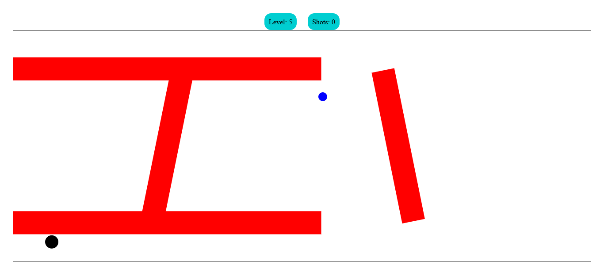

# Golf Game

## Features

### Dragging

to move the ball you drag your mouse in the opposite direction and the longer the dragging distance the more powerful your pass is

### Collisions

this game uses real physics for checking and resolving collisions with the borders of the canvas and the walls and also checking if the golf ball

the collisions use normals and dot products for more realistic physics

### Levels

this game contains 5 levels and a final level with a thanks message

## Technology used

this game is made using only html, css, javascript

## Author

this Project is made by Ziad Elhusiny The GOAT of programming
